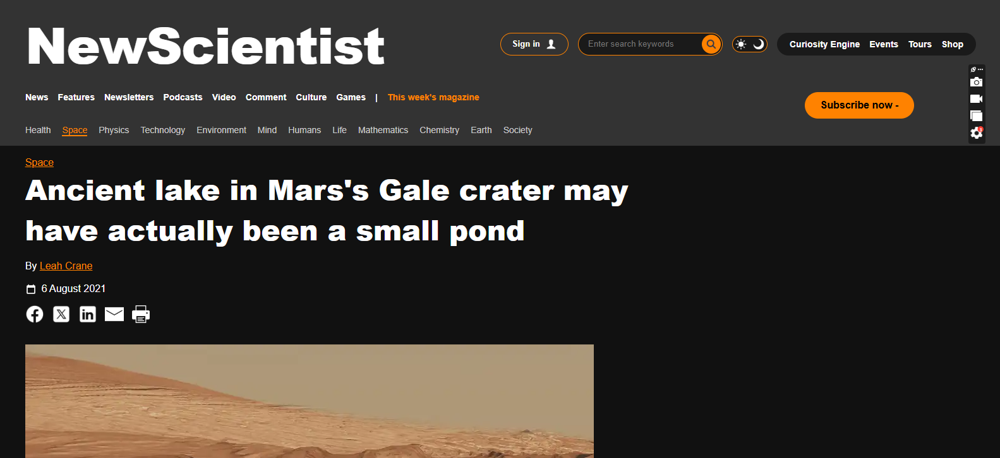

# New Scientist News Page Clone

A HTML/CSS landing page inspired by [New Scientist](https://www.newscientist.com/article/2286218-ancient-lake-in-marss-gale-crater-may-have-actually-been-a-small-pond/)

## Live Demo
[Live Demo link](https://gabrielodunuga.github.io/first-project/)

## Project Files
- index.html — main page content
- style.css - style page content
- Assets — icons and images

## Built With
- HTML5
- CSS3

## 👤 Author
Gabriel Odunuga
GitHub: [@gabrielodunuga](https://github.com/gabrielodunuga)

## Contributions
- Contributions, issues, and feature requests are welcome!

## ⭐ Support
Give a ⭐️ if you like this project!